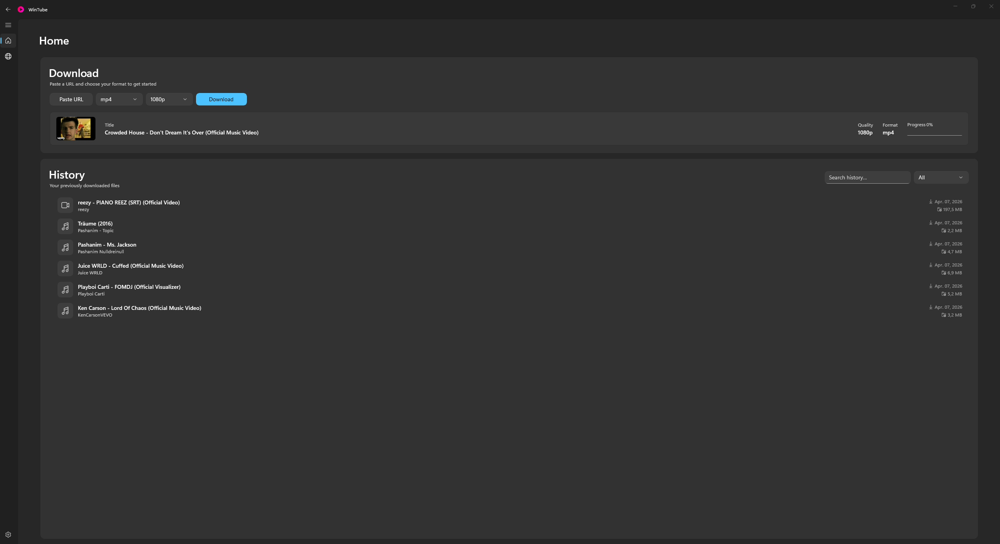
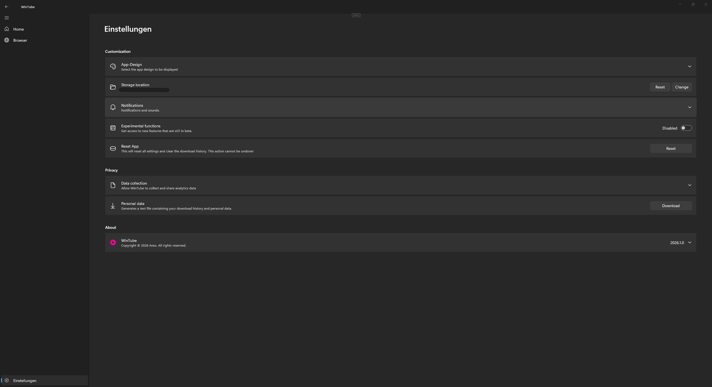

# WinTube Video Downloader

## About

WinTube is a sleek, high-performance YouTube downloader built with C#. Designed for speed and simplicity, it delivers fast downloads of any video in the resolution you need. WinTube combines modern WinUI3 design with uncompromising performance.

## How to install WinTube

- Download and install [.NET 8 Desktop Runtime](https://dotnet.microsoft.com/en-us/download/dotnet/8.0) & (if needed) [WebView 2](https://developer.microsoft.com/de-de/microsoft-edge/webview2/)
- Download the latest WinTube release
- Install WinTube using .msix installer
> After installing just start WinTube and have fun :)

## Found a bug or have some questions?
Please open a issue here on github.

## Preview
**Home**

**Settings**

