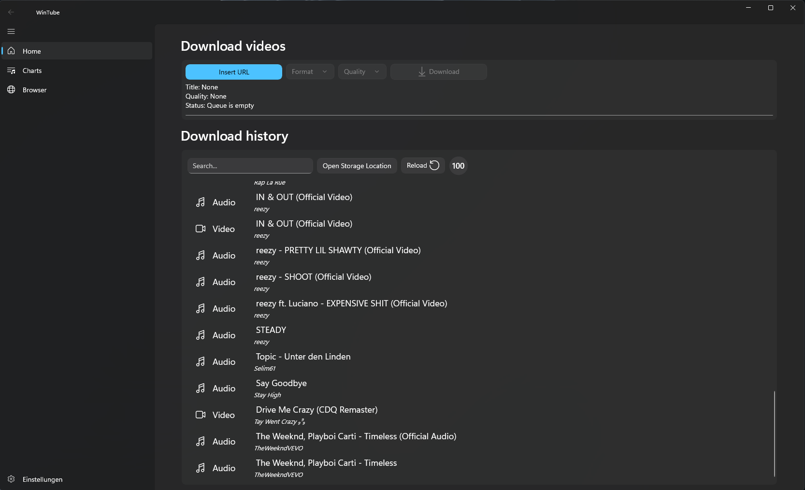

# WinTube Video Downloader

## About

WinTube is a fast and modern Youtube Downloader, programmed in C#. The goal was to create a modern youtube downloader which provides fast downloads of youtube videos in any resolution.

## How to install WinTube

- Download and install [.NET 6 Runtime](https://dotnet.microsoft.com/en-us/download/dotnet/6.0) & [WebView 2](https://developer.microsoft.com/de-de/microsoft-edge/webview2/)
- Download the latest WinTube release
- Unzip the zip file
- Install WinTube with the setup installer (or start the WinTube.exe)
> After installing just start WinTube and have fun :)

## Found a bug or have some questions?
Join our [Discord](https://discord.gg/hwtXqdvVa3)

## Preview

